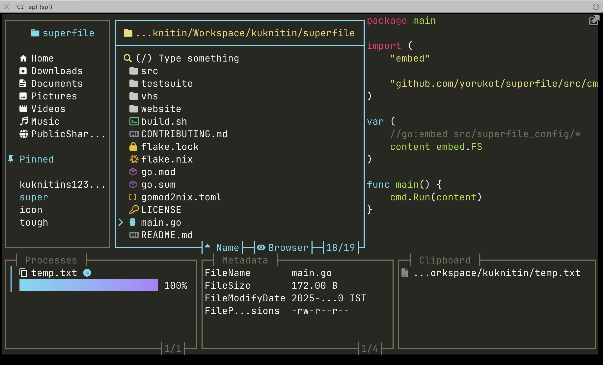
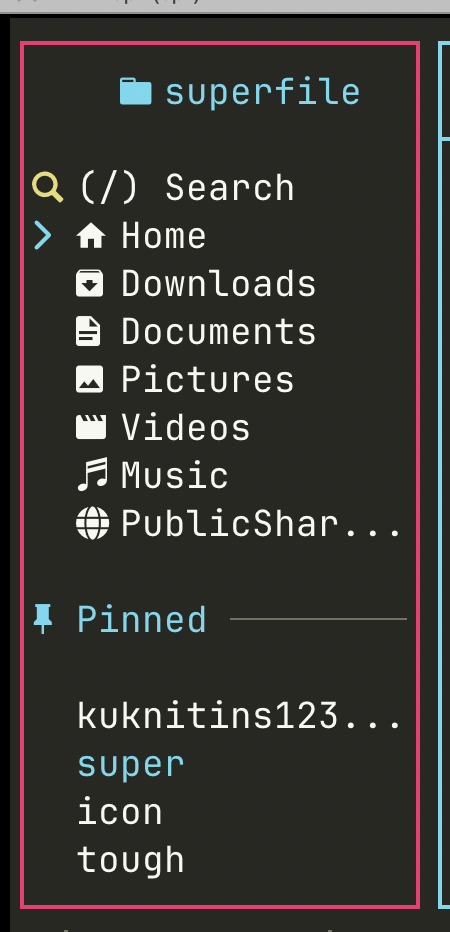
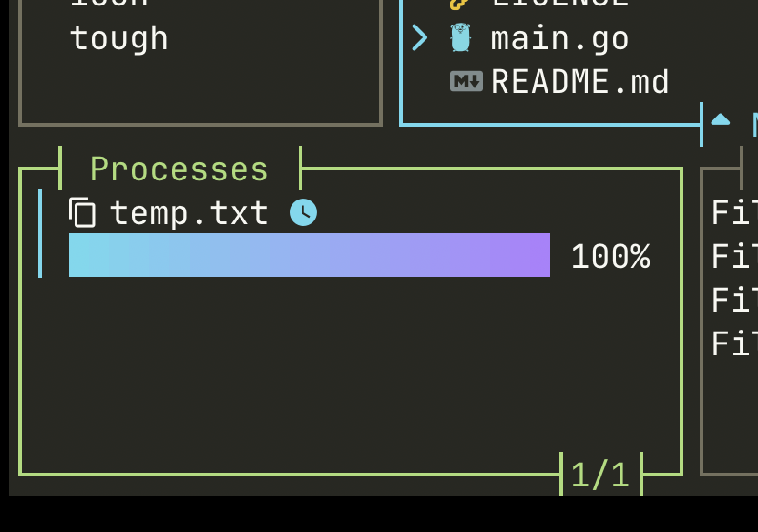
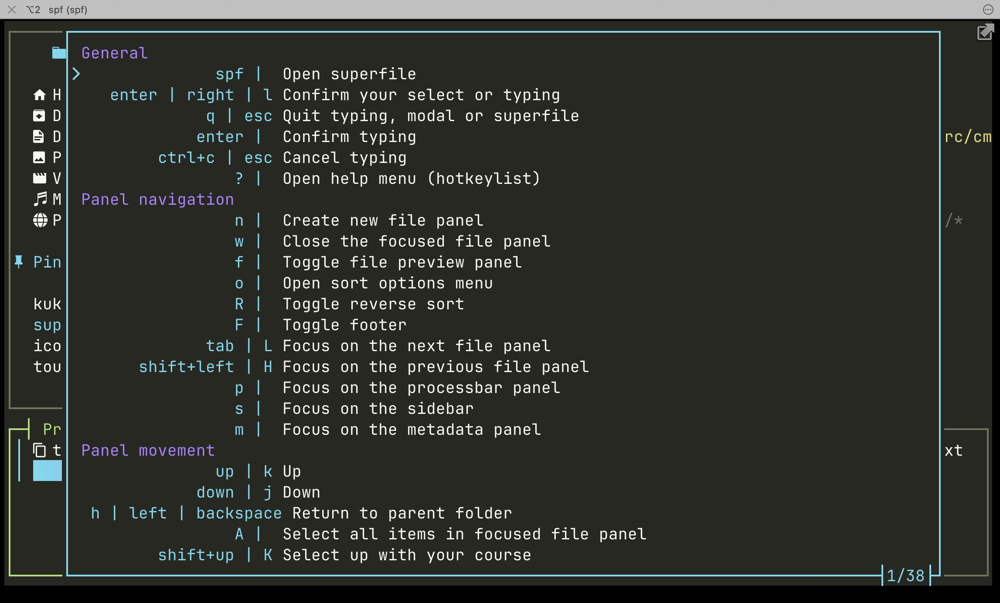
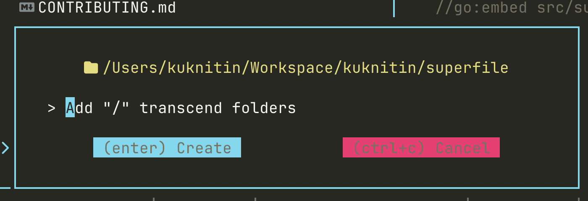
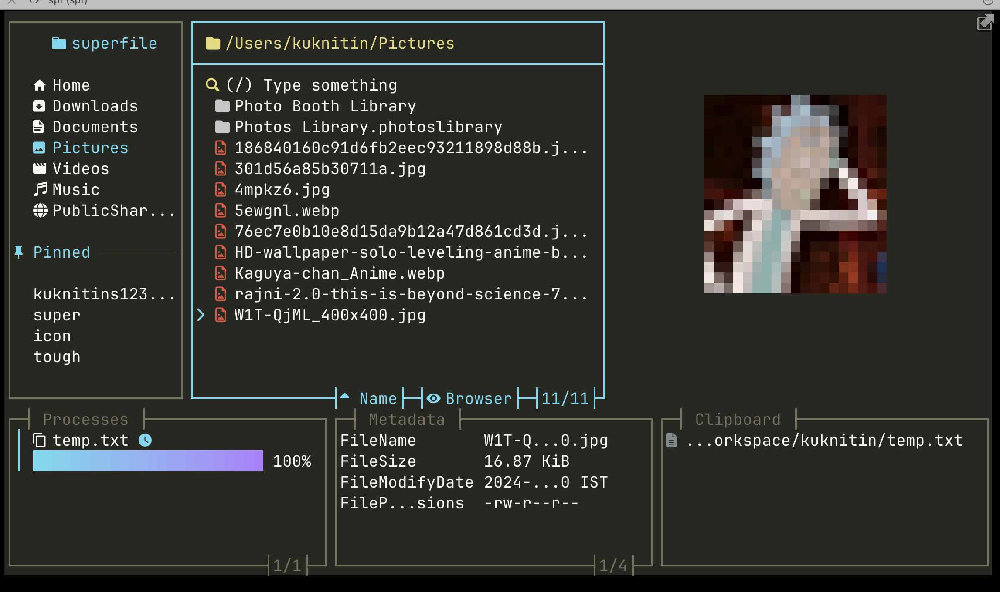
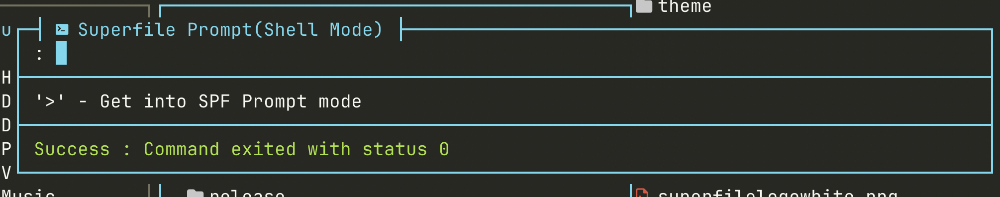
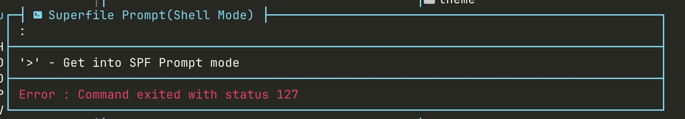

# Contributing to superfile

Welcome to **superfile**! This guide will help you get started contributing to the project, whether you're fixing bugs, building features, or just sharing ideas.

There are many ways to contribute:

* Reporting bugs
* Fixing issues
* Adding a theme
* Suggesting and implementing new features
* Sharing ideas or feedback

---

## 🐞 Issues

### Found a bug?

Check if there's already an open or closed issue for it. If not, open a new one and describe the problem clearly.

### Want to fix an issue?

1. Fork this repository
2. Create a new branch for the issue you're working on
3. Commit your changes with clear messages
4. Open a pull request (PR) with a description of the problem and your solution

Maintainers may request changes before merging.

---

## 🎨 Adding a Theme

Before starting, make sure the theme you want to add doesn’t already exist.

1. Copy an existing theme's `.toml` file as a base
2. Customize it to your needs
3. Test it by editing your `~/.config/superfile/config/config.toml`
4. When ready, submit a pull request
5. To ensure the theme looks consistent and functions properly, please include the following screenshots in your PR:
- Full view of superfile (Including sidebar, file previewer, process panel, metadata panel, and clipboard panel )
    - Make sure that file previewer is non empty, process panel has at least one process, and clipboard has at least one entry
- Add a screenshot of these individual panel being focussed (To make sure border focus color is good)
    - Sidebar
    - Processbar
- Add a screenshot of help menu (Press ?)
- Add a screenshot of popup that opens when you create a new file (Ctrl+n)
- Add a screenshot of image being preview using your theme.
- Add a screenshot of successful and unsuccessful shell command.

Example:

- Full view of superfile (Including sidebar, file previewer, process panel, metadata panel, and clipboard panel)

  - Make sure that file previewer is non empty, process panel has at least one process, and clipboard has at least one entry

  

- Add a screenshot of these individual panels being focused (To make sure border focus color is good)

  - Sidebar
  - Processbar

  

  

- Add a screenshot of help menu (Press `?`)

  

- Add a screenshot of popup that opens when you create a new file (Ctrl+n)

  

- Add a screenshot of image being previewed using your theme

  

- Add a screenshot of successful and unsuccessful shell command

  

  

---

## 💡 Sharing Ideas

Got a new idea? Awesome!

1. Check if similar ideas exist in Discussions or Issues
2. Open a discussion at: [https://github.com/yorukot/superfile/discussions](https://github.com/yorukot/superfile/discussions)
3. If you want to implement it yourself, follow the PR steps above

---

## 🧩 Don’t Know Where to Start?

Check out GitHub’s official guide:
[https://docs.github.com/en/get-started/exploring-projects-on-github/contributing-to-a-project](https://docs.github.com/en/get-started/exploring-projects-on-github/contributing-to-a-project)

Still unsure? Open a discussion — we’re happy to help.

---

## ✅ Pull Request Checklist

Please make sure your PR follows these steps:

* [ ] I have run `go fmt ./...` to format the code
* [ ] I have run `golangci-lint run` and fixed any reported issues
* [ ] I have tested my changes and verified they work as expected
* [ ] I have reviewed the diff to make sure I’m not committing any debug logs or TODOs
* [ ] I have filled out the PR template with description, context, and screenshots if needed
- [ ] I have checked that the PR title follows the [Conventional Commits](https://www.conventionalcommits.org/en/v1.0.0/) format

---

## 🙏 Thank You

Thank you for contributing to superfile! We appreciate every issue, pull request, and idea. Your help makes this project better for everyone.
